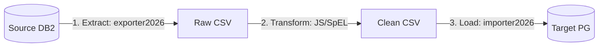

# LLM Migration Runbook & Context Sheet

This document serves as the single source of truth for LLM agents and AI tools to execute, maintain, and extend the biobank database migration from DB2 to PostgreSQL. It is optimized for low token usage and high execution efficiency.

---

## 1. Active Architecture: Generic ETL (Zero-Compile)

The migration is decoupled from custom Java application code. Instead, we use pre-compiled generic tools combined with text-based manifests and JavaScript scripts:



* **Extract:** `exporter2026` runs dynamic JDBC queries against DB2 and flattens PK/FK structures into natural keys in raw CSV files.
* **Transform:** JavaScript scripts (executed dynamically via Java's `ScriptEngine` or SpEL inside `importer2026` pipeline) normalize values, map enums, and generate fallback slugs/identifiers.
* **Load:** `importer2026` reads the YAML manifest, executes row transformations, resolves natural keys to target Postgres surrogate IDs, and bulk-inserts the clean data.

---

## 2. Table Blueprints & Checklist for AI context

To migrate a table (or add a new one), follow this 3-step checklist.

### Step 1: Extract (via `exporter2026`)
Run the exporter pointing to the source DB2 table and output directory. Override datasource url to point to localhost:
```bash
# Path: /Users/muilu/git/exporter2026
./gradlew bootRun --args='--table=BIOBANK3.SRC_TABLE --output=../sample-service-migration/export/src_table.csv --spring.datasource.url=jdbc:db2://localhost:50000/BCDEMO'
```

### Step 2: Define Transformation Script (JavaScript)
If the table has columns requiring transformation (like enums or string cleanup), create a script at `config/scripts/<target_table>_transform.js`:
```javascript
// Example: config/scripts/sample_type_transform.js
function transformAbbreviation(name, oldAbbr) {
    var ABBREVIATION_MAP = {
        "Master Sample": "MS",
        "DNA": "DNA",
        "Plasma": "PL",
        "Serum": "SR"
    };
    if (ABBREVIATION_MAP[name]) {
        return ABBREVIATION_MAP[name];
    }
    if (oldAbbr && !oldAbbr.match(/^\d+$/)) {
        return oldAbbr;
    }
    // Fallback: uppercase letters only, max 20 chars
    var cleaned = name.replace(/[^a-zA-Z0-9]/g, '').toUpperCase();
    if (cleaned.length > 20) {
        cleaned = cleaned.substring(0, 20);
    }
    return cleaned === "" ? "UNKN" : cleaned;
}
```

### Step 3: Define Manifest & Load (via `importer2026`)
Create `config/manifests/<target_table>_manifest.yaml` mapping the CSV to Postgres:
```yaml
import:
  targetTable: "sample.<target_table>"
  operation: "UPSERT"
  batchSize: 1000
  naturalKeys:
    - "name"
  columnMappings:
    - csv: "NAME"
      column: "name"
      type: "VARCHAR"
    - csv: "ABBREVIATION"
      column: "abbreviation"
      type: "VARCHAR"
      transformScript: "config/scripts/<target_table>_transform.js" # Script execution
```
Run `importer2026` to apply transformations and load data into Postgres:
```bash
# Path: /Users/muilu/git/others/sample-service-migration
../../importer2026/gradlew -p ../../importer2026 bootRun --args='--csv=export/src_table.csv --manifest=config/manifests/<target_table>_manifest.yaml --spring.datasource.url=jdbc:postgresql://localhost:5432/sample --spring.datasource.username=sample --spring.datasource.password=sample --spring.datasource.driver-class-name=org.postgresql.Driver --spring.liquibase.change-log=classpath:db/changelog-master.xml --spring.main.web-application-type=none'
```

---

## 3. Database Credentials & Paths

* **Source DB2:** `localhost:50000/BCDEMO` (user: `db2inst1`, password: `Adm1Pwd1`). Config file: `~/.server/centox-dbowner.conf`.
* **Target Postgres:** `localhost:5432/sample` (user: `sample`, password: `sample`, schema: `sample`, audit schema: `bcapp`).
* **Sibling Paths:**
  * Exporter: `/Users/muilu/git/exporter2026`
  * Importer: `/Users/muilu/git/importer2026`
  * Sample Service: `/Users/muilu/git/others/sample-service`
  * Migration workspace: `/Users/muilu/git/others/sample-service-migration`

---

## 4. Troubleshooting & Verification

* **Sequence Reset:** After loading, reset the table sequence to prevent ID collision:
  ```sql
  SELECT setval('sample.<table_name>_id_seq', COALESCE((SELECT MAX(id) FROM sample.<table_name>), 1));
  ```
* **Clear DB:** To clear all target Postgres schemas and Liquibase changelogs:
  ```bash
  make -C ../sample-service db-clear
  ```
