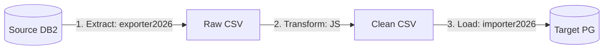

# LLM Migration Runbook & AI Context Sheet

This document serves as the single source of truth for LLM agents and AI tools to execute, maintain, and extend the biobank database migration from DB2 to PostgreSQL. It is optimized for low token usage and high execution efficiency.

---

## 1. Active Architecture: Generic ETL (Zero-Compile)

The migration is completely decoupled from custom Java application code. Instead, we use pre-compiled generic tools combined with text-based manifests and JavaScript scripts:



* **Extract:** `exporter2026` runs dynamic JDBC queries against DB2 and flattens PK/FK structures into natural keys in raw CSV files.
* **Transform:** JavaScript scripts (executed dynamically via Java's Nashorn engine inside `importer2026` pipeline) normalize values, map enums, and generate fallback slugs/identifiers.
* **Load:** `importer2026` reads the YAML manifest, executes row transformations, resolves natural keys to target Postgres surrogate IDs (caching queries for performance and self-joins), and bulk-inserts the clean data.

---

## 2. Status of Migrations

* **sample_type**: ✅ **COMPLETE**. Migrated successfully using the generic ETL method with [sample_type_manifest.yaml](file:///Users/muilu/git/others/sample-service-migration/config/manifests/sample_type_manifest.yaml) and [sample_type_transform.js](file:///Users/muilu/git/others/sample-service-migration/config/scripts/sample_type_transform.js). Legacy `SampleTypeLoader.java` has been removed.
* **container_type**: ✅ **COMPLETE**. Migrated successfully using the generic ETL method with [container_type_manifest.yaml](file:///Users/muilu/git/others/sample-service-migration/config/manifests/container_type_manifest.yaml) and [container_type_transform.js](file:///Users/muilu/git/others/sample-service-migration/config/scripts/container_type_transform.js).
* **container**: ✅ **COMPLETE**. Migrated successfully using the generic ETL method with [container_manifest.yaml](file:///Users/muilu/git/others/sample-service-migration/config/manifests/container_manifest.yaml). Note: Because containers contain self-referential parent-child relationships, `--sort-self-joins` must be used during import to guarantee correct parent resolution.
* **sample**: ✅ **COMPLETE**. Migrated successfully using the generic ETL method with [sample_manifest.yaml](file:///Users/muilu/git/others/sample-service-migration/config/manifests/sample_manifest.yaml) and [sample_transform.js](file:///Users/muilu/git/others/sample-service-migration/config/scripts/sample_transform.js).
* **sample_property**: ✅ **COMPLETE**. Migrated legacy subclass tables (`SAMPLE_10003` DNA, `SAMPLE_10004` EDTA, `SAMPLE_10029` TestNäyte) into the new PostgreSQL EAV table using [PivotHelper.java](file:///Users/muilu/git/others/sample-service-migration/scripts/PivotHelper.java) for dynamic unpivoting and [sample_property_manifest.yaml](file:///Users/muilu/git/others/sample-service-migration/config/manifests/sample_property_manifest.yaml) with [property_transform.js](file:///Users/muilu/git/others/sample-service-migration/config/scripts/property_transform.js) for column-type routing. Fully documented in the active [sample-properties-migration-plan.md](file:///Users/muilu/git/others/sample-service-migration/docs/sample-properties-migration-plan.md).
* **sample_quality**: ✅ **COMPLETE**. Migrated legacy qualities using the generic ETL method. Controlled vocabulary `cv_sample_quality` seeded via [seed_qualities.sql](file:///Users/muilu/git/others/sample-service-migration/scripts/postgres/seed_qualities.sql), allowed metadata via [sample_type_quality_metadata_manifest.yaml](file:///Users/muilu/git/others/sample-service-migration/config/manifests/sample_type_quality_metadata_manifest.yaml), and sample quality mappings via [sample_quality_manifest.yaml](file:///Users/muilu/git/others/sample-service-migration/config/manifests/sample_quality_manifest.yaml). Fully documented in [sample-qualities-migration-plan.md](file:///Users/muilu/git/others/sample-service-migration/docs/sample-qualities-migration-plan.md).

---

## 3. Step-by-Step Playbook for Migrating a New Table (Zero-Compile)

When migrating the next table, follow these exact steps to save tokens and avoid redundant research:

### Step 1: Extract (via `exporter2026`)
Run the exporter pointing to the source DB2 table and output directory. Always use absolute paths for the output file:
```bash
# Path: /Users/muilu/git/exporter2026
./gradlew bootRun --args='--table=BIOBANK3.SRC_TABLE --output=/Users/muilu/git/others/sample-service-migration/export/src_table.csv --spring.datasource.url=jdbc:db2://localhost:50000/BCDEMO --spring.datasource.username=db2inst1 --spring.datasource.password=Adm1Pwd1'
```

### Step 2: Define Transformation Script (JavaScript)
If the table has columns requiring transformation (like enums or string cleanup), create a script at `config/scripts/<target_table>_transform.js`. 
* Keep transformations **stateless/independent** of the database.
* To support relative paths, `importer2026` resolves paths relatively to the manifest file location if they are not found in the current working directory.

### Step 3: Define Manifest & Load (via `importer2026`)
Create `config/manifests/<target_table>_manifest.yaml` mapping the CSV to Postgres.
* **Important:** Always override the driver class name to Postgres when running `importer2026`, as the default in its `application.properties` is DB2: `--spring.datasource.driver-class-name=org.postgresql.Driver`
* If the table contains self-referential parent-child foreign keys (specifically `sample` or `container`), always append the `--sort-self-joins` command-line argument.
* Always use absolute paths for the CSV and manifest parameters when running via Gradle, as the working directory switches to the sibling folder:
```bash
# Path: /Users/muilu/git/others/sample-service-migration
../../importer2026/gradlew -p ../../importer2026 bootRun --args='--csv=/Users/muilu/git/others/sample-service-migration/export/src_table.csv --manifest=/Users/muilu/git/others/sample-service-migration/config/manifests/target_table_manifest.yaml --spring.datasource.url=jdbc:postgresql://localhost:5432/sample --spring.datasource.username=sample --spring.datasource.password=sample --spring.datasource.driver-class-name=org.postgresql.Driver --spring.main.web-application-type=none --sort-self-joins'
```

### Step 4: Verification & Sequence Reset
1. Empty the target table before starting: `TRUNCATE sample.target_table CASCADE;`
   > [!WARNING]
   > `TRUNCATE` is only used during local development, staging tests, and initial clean imports. 
   > In production cutover or delta migrations, do **NOT** run truncate. The loader uses idempotent `UPSERT` (`ON CONFLICT DO UPDATE`) to safely merge changes and allow resuming runs from failures.
2. Run the load step.
3. After loading, reset the database sequence:
   ```sql
   SELECT setval('sample.<table_name>_id_seq', COALESCE((SELECT MAX(id) FROM sample.<table_name>), 1));
   ```
4. Verify row counts and spot-check data integrity.

---

## 4. Sibling Project Paths & Connections

* **Source DB2:** `jdbc:db2://localhost:50000/BCDEMO` (user: `db2inst1`, password: `Adm1Pwd1`).
* **Target Postgres:** `jdbc:postgresql://localhost:5432/sample` (user: `sample`, password: `sample`).
* **Sibling Paths:**
  * Exporter: `/Users/muilu/git/exporter2026`
  * Importer: `/Users/muilu/git/importer2026`
  * Migration workspace: `/Users/muilu/git/others/sample-service-migration` (this repository)

---

## 5. Summary of importer2026 Capabilities
The generic importer (`importer2026`) has the following features pre-built and ready:
- **Implicit Column Types**: The `type` field in column mappings is optional; if omitted, it is auto-discovered from target database metadata.
- **FK Resolution**: Resolves natural keys to surrogate IDs automatically based on `foreignKey` mapping block in manifest.
- **Self-Joins**: Caches resolved IDs and registers newly inserted rows so that parent-child relationships (like parent containers or parent samples) are resolved in a single pass (assuming parents come before children in the sorted CSV).
- **JavaScript Engine**: Embedded Nashorn engine executes JS transformations natively inside JVM 21, allowing stateless transformations without IPC overhead.
- **Row-by-Row RETURNING id & FK Caching (New)**: The importer inserts rows one-by-one appending `RETURNING id` and registers each successful insert's natural keys + generated ID in the resolver cache. This ensures self-referential rows (e.g. child containers referencing parent containers, or aliquots referencing parent samples) in the same file resolve their parent references dynamically.
- **Nullable FKs (New)**: If all mapped CSV columns for a foreign key are empty/blank, the importer directly assigns a `NULL` target value without throwing "Missing foreign key" errors, supporting optional parent references and unplaced containers/samples.
- **Topological Sorting (`--sort-self-joins`) (New)**: The `--sort-self-joins` command-line argument enables topological sorting of CSV rows prior to import. It constructs a dependency graph using the self-referencing foreign keys defined in the manifest, ensuring parents are imported before children. It falls back gracefully and warns if cyclic dependencies are detected.
