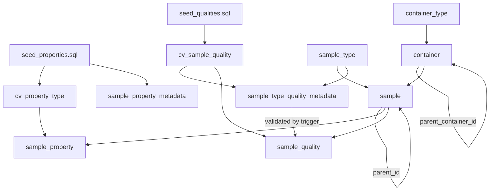

# Migration Orchestration & Full Execution Playbook

This document details the orchestration strategy, table dependencies, and execution sequence to perform a complete, end-to-end data migration from the source DB2 database to PostgreSQL in a single run.

---

## 1. Unified ETL Architecture

The migration is built on a zero-compile, generic ETL model. It does not use custom Java class loaders. Instead, it relies on:
1. **`exporter2026`**: Extracts DB2 tables and views to raw CSV files.
2. **SQL Seed Scripts**: Inject primary key-based controlled vocabularies directly.
3. **`PivotHelper.java`**: Transforms flat subclass tables into vertical EAV properties.
4. **`importer2026`**: Maps, validates, resolves foreign keys, and loads datasets using YAML manifests and JavaScript scripts.

All steps are consolidated into targets within the root [Makefile](file:///Users/muilu/git/others/sample-service-migration/Makefile), enabling operators to run the entire pipeline with a single command:
```bash
make migrate-all
```

---

## 2. Table Dependency & Loading Order

Due to foreign key constraints and validation triggers in PostgreSQL, tables must be loaded in a strict topological order.



### Loading Order Phases
1. **Vocabulary Seeding**:
   - `seed_properties.sql` (populates `cv_property_type` & `sample_property_metadata`)
   - `seed_qualities.sql` (populates `cv_sample_quality`)
2. **Metadata Loading**:
   - `sample_type` (from `samplegroup.csv`)
   - `container_type` (from `containertype.csv`)
3. **Hierarchical Container Loading**:
   - `container` (uses `--sort-self-joins` to resolve nested parent containers)
4. **Hierarchical Sample Loading**:
   - `sample` (uses `--sort-self-joins` to resolve nested parent aliquots)
5. **EAV Property Loading**:
   - `sample_property` (processed separately for DNA, EDTA, and TestNäyte)
6. **Trigger Constraint Validation & Quality Loading**:
   - `sample_type_quality_metadata` (allowed quality codes per sample type)
   - `sample_quality` (sample quality mappings; validated on write by `tr_validate_sample_quality` trigger)

---

## 3. Idempotency & Resiliency

All manifests are configured with `operation: UPSERT`. This guarantees that:
* **Interruptible & Resumable**: If a step fails, the operator can fix the manifest/data and resume. Previously loaded rows will be updated on conflict (using unique natural keys), avoiding duplicates.
* **Repeated Runs**: Re-executing the migration on top of existing data is safe and will not violate unique constraints.

For clean/fresh runs, the database should be cleared first:
```bash
make clear-target
```
This performs a `TRUNCATE CASCADE` on the target tables in the correct order to avoid constraint violations.

---

## 4. Execution Playbook

### Step 1: Validate Source
Verify connection to DB2:
```bash
make validate-source
```

### Step 2: Clear PostgreSQL Target
```bash
make clear-target
```

### Step 3: Extract Data
Run `exporter2026` to generate raw CSV extracts from DB2:
```bash
make extract-data
```

### Step 4: Transform Data
Execute property unpivoting and compile quality metadata:
```bash
make transform-data
```

### Step 5: Load Target
Seed schemas, import all data tables using `importer2026`, and reset sequence generators:
```bash
make load-target
```

### Step 6: Verify Data
Verify that target record counts match the source:
```bash
make verify
```

---

## 5. Verification & QA Matrix

Running `make verify` produces a report of target records. Match them against this DB2 source count checklist:

| Target Table | Expected Rows | Source DB2 Table / View |
|--------------|---------------|-------------------------|
| `sample_type` | **11** | `BIOBANK3.SAMPLEGROUP` |
| `container_type` | **9** | `BIOBANK3.CONTAINERTYPE` |
| `container` | **85** | `BIOBANK3.CONTAINER` |
| `sample` | **4102** | `BIOBANK3.VIEW_SAMPLE_MASTER` |
| `sample_property` | **4700** | Subclass tables (`SAMPLE_10003` etc.) pivoted |
| `cv_sample_quality` | **40** | `BIOBANK3.CV_QUALITY` |
| `sample_type_quality_metadata` | **11** | Distinct active `(SAMPLETYPE, QUALITY)` combinations |
| `sample_quality` | **493** | `BIOBANK3.SAMPLE_QUALITY` |
