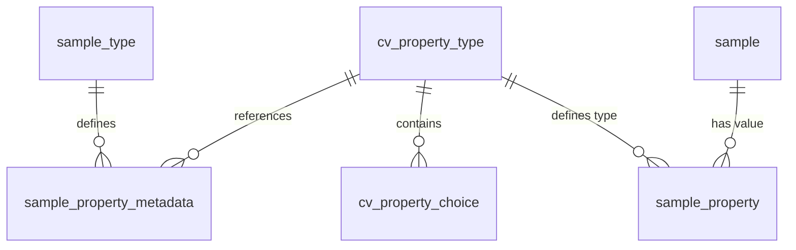

# Migration Plan & Playbook: Sample Type Specific Properties

This document outlines the architecture, pipeline, and execution playbook for migrating sample type-specific properties from the legacy DB2 database to the new PostgreSQL database using a dynamic, generic, and zero-compile ETL approach.

---

## 1. Current Architecture & Findings

### 1.1 DB2 Source Database
In the legacy DB2 database, common sample information is stored in the master table `BIOBANK3.SAMPLE_10002`. Sample type-specific properties are stored in subclass tables `BIOBANK3.SAMPLE_NNNNN`, where `NNNNN` matches the group number (`GROUPNR`) of the sample type.
Through DB2 metadata catalog inspection, we discovered the following active subclass tables with custom property columns:

1. **DNA (Group `10003`):** Table `BIOBANK3.SAMPLE_10003`
   - *Columns:* `QUANTITY` (REAL), `ELUTION_VOLUME` (INT), `DILUTION_FACTOR` (REAL), `ABS260` (REAL), `ABS280` (REAL), `ABS230` (REAL), `ABS260280` (REAL), `ABS260230` (REAL), `EXTRACTIONMETHOD` (VARCHAR), `EXTRACTIONSITE` (VARCHAR), `FACTOR` (INT).
   - *Unused columns:* `PROFILE`, `PARENT`, `BATCH`, `USERNAME`, `TIMELOG` (to be ignored).
2. **EDTA Whole Blood (Group `10004`):** Table `BIOBANK3.SAMPLE_10004`
   - *Columns:* `LIQUID_LEVEL` (INT), `PLASMA_LEVEL` (INT), `SEPARATION_LEVEL` (INT).
3. **TestNäyte (Group `10029`):** Table `BIOBANK3.SAMPLE_10029`
   - *Columns:* `LVMS` (VARCHAR).
4. **All other subclass tables** (Plasma `10008`, Serum `10010`, EDTA cord blood `10012`, Tissue `10014`, Maternal Whole Blood `10027`, EDTA Plasma `10030`) only contain the unused columns and require no property migration.

### 1.2 PostgreSQL Target Database (`sample-service`)
In `sample-service`, dynamic properties are implemented using an **Entity-Attribute-Value (EAV)** pattern, defined in [v005-properties.sql](file:///Users/muilu/git/others/sample-service/src/main/resources/db/scripts/sample/v005-properties.sql):



1. **`sample.cv_property_type`**: Vocabulary dictionary defining property keys, names, and data types (`term`).
2. **`sample.sample_property_metadata`**: Links vocabulary terms to sample types.
3. **`sample.sample_property`**: The actual property values for each sample. Values are stored in type-specific columns (`string_value`, `integer_value`, `float_value`, `choice_value`, etc.), with all other columns remaining `NULL`.

---

## 2. Migration Process (Zero-Compile ETL)

The migration process is split into three phases: **Extract**, **Transform (Dynamic Unpivot)**, and **Load**.

```
+--------------------+      +-------------------------+      +---------------------------+
| DB2: SAMPLE_NNNNN  | ---> | Flat CSV:               | ---> | Java Transform (Unpivot): |
| (Subclass table)   |      | SAMPLE_10002_SAMPLEID,  |      | PivotHelper.java          |
|                    |      | property columns        |      |                           |
+--------------------+      +-------------------------+      +---------------------------+
                                                                           |
                                                                           v
+-------------------------+      +-------------------------+      +---------------------------+
| Postgres:               | <--- | importer2026            | <--- | EAV CSV:                  |
| sample.sample_property  |      | (with JS transform)     |      | SAMPLEID, PROPERTY_TERM,  |
|                         |      |                         |      | VALUE                     |
+-------------------------+      +-------------------------+      +---------------------------+
```

### Phase 1: Extract
Run `exporter2026` to extract subclass tables joined with the master table `SAMPLE_10002` to fetch the natural sample key `SAMPLEID` (aliased as `SAMPLE_10002_SAMPLEID`).

```bash
# DNA (10003)
../../exporter2026/gradlew -p ../../exporter2026 bootRun --args='--table=BIOBANK3.SAMPLE_10003 --output=/Users/muilu/git/others/sample-service-migration/export/sample_10003.csv --spring.datasource.url=jdbc:db2://localhost:50000/BCDEMO --spring.datasource.username=db2inst1 --spring.datasource.password=Adm1Pwd1'

# EDTA Whole Blood (10004)
../../exporter2026/gradlew -p ../../exporter2026 bootRun --args='--table=BIOBANK3.SAMPLE_10004 --output=/Users/muilu/git/others/sample-service-migration/export/sample_10004.csv --spring.datasource.url=jdbc:db2://localhost:50000/BCDEMO --spring.datasource.username=db2inst1 --spring.datasource.password=Adm1Pwd1'

# TestNäyte (10029)
../../exporter2026/gradlew -p ../../exporter2026 bootRun --args='--table=BIOBANK3.SAMPLE_10029 --output=/Users/muilu/git/others/sample-service-migration/export/sample_10029.csv --spring.datasource.url=jdbc:db2://localhost:50000/BCDEMO --spring.datasource.username=db2inst1 --spring.datasource.password=Adm1Pwd1'
```

### Phase 2: Transform (Dynamic Unpivot)
Execute [PivotHelper.java](file:///Users/muilu/git/others/sample-service-migration/scripts/PivotHelper.java). This single-file Java program runs directly on any JVM 11+ without compilation. It dynamically reads `export/samplegroup.csv` and `export/sample_property_metadata.csv` to discover the allowed properties for the given group, maps columns case-insensitively (ignoring underscores), and generates a vertical EAV CSV file.

```bash
# DNA (10003)
java scripts/PivotHelper.java export/sample_10003.csv export/sample_property_dna.csv 10003

# EDTA Whole Blood (10004)
java scripts/PivotHelper.java export/sample_10004.csv export/sample_property_edta.csv 10004

# TestNäyte (10029)
java scripts/PivotHelper.java export/sample_10029.csv export/sample_property_testnayte.csv 10029
```

### Phase 3: Load

#### A. Seed Controlled Vocabulary and Metadata
Because `importer2026` expects target tables to contain an `id` surrogate primary key for foreign key resolution, loading the dictionary tables `cv_property_type` (PK `term`) and `sample_property_metadata` (PK `(sample_type_id, property_term)`) is done directly using a seed SQL script [seed_properties.sql](file:///Users/muilu/git/others/sample-service-migration/scripts/postgres/seed_properties.sql):

```bash
docker exec -i sample-service-db-1 psql -U sample -d sample < /Users/muilu/git/others/sample-service-migration/scripts/postgres/seed_properties.sql
```

#### B. Load Property Values via `importer2026`
The unpivoted EAV values are loaded using `importer2026` with the [sample_property_manifest.yaml](file:///Users/muilu/git/others/sample-service-migration/config/manifests/sample_property_manifest.yaml) manifest. A Nashorn JS script [property_transform.js](file:///Users/muilu/git/others/sample-service-migration/config/scripts/property_transform.js) automatically inspects the vocabulary definitions and routes the `VALUE` to the correct type-specific column in PostgreSQL, returning `null` for non-matching ones.

```bash
# Load EDTA Whole Blood properties
../../importer2026/gradlew -p ../../importer2026 bootRun --args='--csv=/Users/muilu/git/others/sample-service-migration/export/sample_property_edta.csv --manifest=/Users/muilu/git/others/sample-service-migration/config/manifests/sample_property_manifest.yaml --spring.datasource.url=jdbc:postgresql://localhost:5432/sample --spring.datasource.username=sample --spring.datasource.password=sample --spring.datasource.driver-class-name=org.postgresql.Driver --spring.main.web-application-type=none'

# Load TestNäyte properties
../../importer2026/gradlew -p ../../importer2026 bootRun --args='--csv=/Users/muilu/git/others/sample-service-migration/export/sample_property_testnayte.csv --manifest=/Users/muilu/git/others/sample-service-migration/config/manifests/sample_property_manifest.yaml --spring.datasource.url=jdbc:postgresql://localhost:5432/sample --spring.datasource.username=sample --spring.datasource.password=sample --spring.datasource.driver-class-name=org.postgresql.Driver --spring.main.web-application-type=none'
```

#### C. Reset Sequence
Always reset the PostgreSQL sequence immediately after importing:
```bash
docker exec -i sample-service-db-1 psql -U sample -d sample -c "SELECT setval('sample.sample_property_id_seq', COALESCE((SELECT MAX(id) FROM sample.sample_property), 1));"
```

---

## 3. Validation & Quality Assurance

After loading, run the following PostgreSQL verification queries to ensure correct migration:

### SQL 3.1: Verify Dynamic Data Type Routing
Verify that property terms are routed to their correct datatype columns:
```sql
SELECT property_term, COUNT(*), COUNT(integer_value) AS int_cnt, COUNT(float_value) AS float_cnt, COUNT(string_value) AS str_cnt
FROM sample.sample_property
GROUP BY property_term;
```
*Expected Output:*
- `plasma_level`, `liquid_level`, `separation_level` must have `int_cnt` populated and all others 0.
- `lvms` must have `str_cnt` populated and all others 0.

### SQL 3.2: Verify Audit Trail Trigger
Check that database triggers successfully captured the inserts into the audit table:
```sql
SELECT COUNT(*) FROM sample.sample_property_audit;
```
*Expected Output:* Matches the total row count of `sample_property`.
