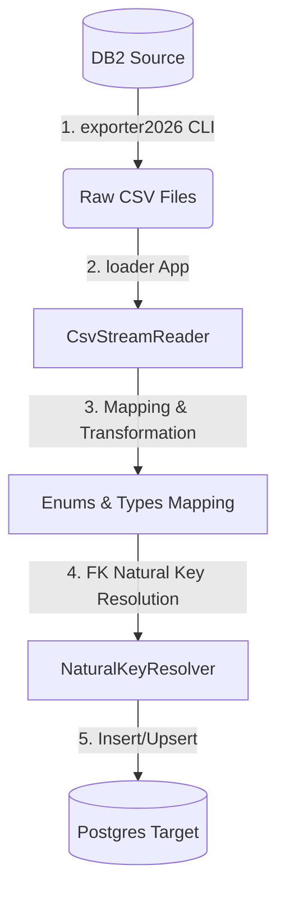
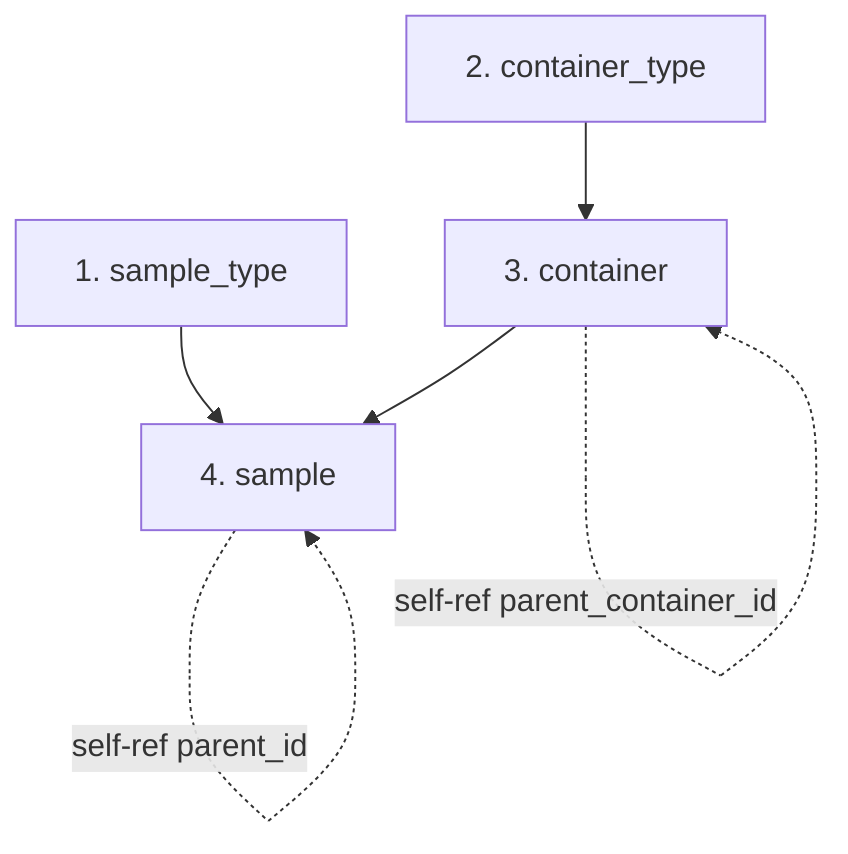

# Technical Execution Guide: DB2 ↔ PostgreSQL Migration

> [!IMPORTANT]
> This document contains legacy design references to a custom Java 'loader' application. The project has migrated to a generic, script-based ETL model using `exporter2026`, `importer2026`, and JS/SpEL manifests. Refer to [LLM_MIGRATION_RUNBOOK.md](file:///Users/muilu/git/others/sample-service-migration/LLM_MIGRATION_RUNBOOK.md) for the active design and execution playbook.

This document describes the technical architecture, execution flow, codebase changes, and step-by-step commands to run the migration for all 4 tables (`sample_type`, `container_type`, `container`, `sample`).

---

## 1. Technical Architecture & Component Flow

The migration relies on three core components:
1. **DB2 Source Database**: The live source data.
2. **`exporter2026` (CLI)**: Purpose-built Java tool to extract DB2 tables/views into CSV format, resolving simple relations to natural keys.
3. **`loader` (Spring Boot App)**: Custom Java 21 app that parses the CSVs, transforms data types/structures, resolves references against target Postgres, and loads them in dependency order.
4. **PostgreSQL Target (`sample-service`)**: The target database.



---

## 2. Order of Execution (Dependency Hierarchy)

Because the tables contain foreign key dependencies (including self-referential parent-child relationships), the migration **must** be executed in the following order:



### Detailed Order:
1. **`sample.sample_type`**: Independent (depends on no other tables).
2. **`sample.container_type`**: Independent.
3. **`sample.container`**: Depends on `container_type_id`. Also contains a self-referential hierarchy `parent_container_id`.
4. **`sample.sample`**: Depends on `sample_type_id` and `container_id`. Also contains a self-referential hierarchy `parent_id` (aliquots reference primary sample).

---

## 3. Step-by-Step Execution Playbook

### Step 1: Initialize PostgreSQL Target Schema
Before running the loader, ensure the target Postgres schema is fully created and matches the latest migrations from `sample-service`.
```bash
# In the sample-service project root, run Liquibase migrations to create the schema:
cd /Users/muilu/git/others/sample-service
./gradlew update
```

### Step 2: Extract CSV Data from DB2
Extract the tables from the DB2 instance. Using `exporter2026` CLI, run the export tasks:
```bash
cd /Users/muilu/git/exporter2026

# Export Sample Groups (Sample Types)
./gradlew bootRun --args='--table=BIOBANK3.SAMPLEGROUP --output=/Users/muilu/git/others/sample-service-migration/export/samplegroup.csv'

# Export Container Types
./gradlew bootRun --args='--table=BIOBANK3.CONTAINERTYPE --output=/Users/muilu/git/others/sample-service-migration/export/containertype.csv'

# Export Containers
./gradlew bootRun --args='--table=BIOBANK3.CONTAINER --output=/Users/muilu/git/others/sample-service-migration/export/container.csv'

# Export Samples (using the flattened VIEW_SAMPLE_MASTER)
./gradlew bootRun --args='--table=BIOBANK3.VIEW_SAMPLE_MASTER --output=/Users/muilu/git/others/sample-service-migration/export/sample.csv'
```

### Step 3: Run the Loader Application
Once raw CSVs are saved in the `export/` directory, launch the `loader` Spring Boot app to transform and insert the data:
```bash
cd /Users/muilu/git/others/sample-service-migration

# Build the loader
../../exporter2026/gradlew -p loader build

# Run the loader
../../exporter2026/gradlew -p loader bootRun --args='--input-dir=export'
```

---

## 4. Coding the Loader Implementation

To make the loader operational, the following classes should be added under `loader/src/main/java/com/bcplatforms/samplemigration/load/`:

### A. `SampleTypeLoader`
- Read `/export/samplegroup.csv`.
- Normalize abbreviations (e.g. `10003` → `DNA`).
- Batch insert using `JdbcTemplate`:
  ```sql
  INSERT INTO sample.sample_type (name, abbreviation, description, userstamp, created, version)
  VALUES (?, ?, ?, ?, ?, 1)
  ON CONFLICT (name) DO NOTHING;
  ```

### B. `ContainerTypeLoader`
- Read `/export/containertype.csv`.
- Map legacy `BASETYPE` values to enum: `SITE`, `FREEZER`, `RACK`, `SHELF`, `BOX`, `PLATE`.
- Remap legacy values like `'no-location'`, `'trash'` and `'used'` to `'SITE'` (or filter them out).
- Batch insert.

### C. `ContainerLoader` (Handling Self-Ref Hierarchy)
- **Problem**: Containers can reference parent containers that haven't been loaded yet.
- **Solution**: Execute migration in passes or sort by depth.
  - *Pass 1*: Load all containers with `PARENT = NULL` (top-level locations like sites and freezers).
  - *Pass 2*: Recursively load containers referencing already loaded containers (Racks inside Freezers, Shelves inside Racks, Boxes inside Shelves, Plates inside Boxes).
- Lookup `container_type_id` via `NaturalKeyResolver.resolveContainerTypeId(typeName)`.
- Lookup `parent_container_id` via `NaturalKeyResolver.resolveContainerId(parentName)`.

### D. `SampleLoader` (Handling Self-Ref Hierarchy & Placements)
- **Problem**: Aliquots reference parent samples (`parent_id`).
- **Solution**:
  - *Pass 1*: Insert all samples where `PARENT_SAMPLEID = NULL` (primary samples).
  - *Pass 2*: Insert all samples where `PARENT_SAMPLEID` is not null (aliquots).
- Lookup `sample_type_id` via `NaturalKeyResolver.resolveSampleTypeId(name, abbr)`.
- Lookup `container_id` via `NaturalKeyResolver.resolveContainerId(containerName)`.
- Lookup `parent_id` via `NaturalKeyResolver.resolveSampleId(parentSampleid)`.
- Map `SAMPLE_STATUS` using updated `SampleStatusMapper` (handling space replacement, e.g., `'Not available'` → `'NOT_AVAILABLE'`).

---

## 5. Post-Migration Database Sequence Reset

Since the loaders will insert rows with explicit IDs or rely on sequences, target database sequence counters must be updated to match the maximum primary key values.
Run the following SQL script post-migration:
```sql
SELECT setval('sample.sample_type_id_seq', COALESCE((SELECT MAX(id) FROM sample.sample_type), 1));
SELECT setval('sample.container_type_id_seq', COALESCE((SELECT MAX(id) FROM sample.container_type), 1));
SELECT setval('sample.container_id_seq', COALESCE((SELECT MAX(id) FROM sample.container), 1));
SELECT setval('sample.sample_id_seq', COALESCE((SELECT MAX(id) FROM sample.sample), 1));
```
This prevents subsequent inserts in the active application from throwing unique primary key constraint violations.
