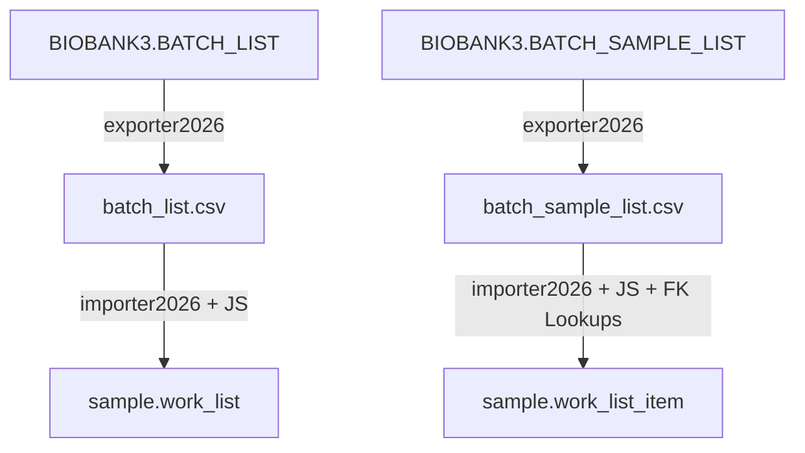

# Work Lists Migration Plan (DB2 ↔ Postgres)

This document outlines the design, mapping, and execution playbook for migrating historical work lists (picking lists and other sample lists) from the legacy DB2 schema to the new PostgreSQL `sample-service` schema.

---

## 1. Architectural Overview

The legacy DB2 database represents work lists using two tables:
1. `BIOBANK3.BATCH_LIST` (Header data for batches/lists)
2. `BIOBANK3.BATCH_SAMPLE_LIST` (Junction table linking samples to batches with execution status)

The new PostgreSQL database defines these concepts under:
1. `sample.work_list` (Header table for lab work lists)
2. `sample.work_list_item` (Junction table linking samples to work lists)

Both systems use controlled vocabularies (CVs) to manage types, list statuses, and item statuses. Since the database structures and enum values differ, we use the **Generic ETL (Zero-Compile)** approach: extracting raw DB2 tables using `exporter2026`, executing dynamic normalization using JavaScript transformations, and importing the data via `importer2026` using natural key lookups.



---

## 2. Prerequisites & Schema Activation

The target tables `work_list` and `work_list_item` are defined in the sibling project `sample-service` in the Liquibase changeset [v007-work-lists.sql](file:///Users/muilu/git/others/sample-service/src/main/resources/db/scripts/sample/v007-work-lists.sql). 

Before executing the data load, this changeset must be applied to the target database:
1. Start the Spring Boot application in the `sample-service` sibling project (which automatically runs Liquibase migrations):
   ```bash
   # In /Users/muilu/git/others/sample-service
   make backend-run
   ```
2. Verify that the tables are created in the PostgreSQL `sample` schema:
   * `sample.cv_work_list_type`
   * `sample.cv_work_list_status`
   * `sample.cv_work_list_item_status`
   * `sample.work_list`
   * `sample.work_list_item`

---

## 3. Data Mapping & Transformations

### 3.1. Work List Header: `BIOBANK3.BATCH_LIST` → `sample.work_list`

The unique business key for work lists is the `name` column.

| DB2 Column | Postgres Column | Target Type | Mapping / Transformation Rule |
|:---|:---|:---|:---|
| `NAME` | `name` | `VARCHAR(128)` | Direct copy (PK/Natural Key). |
| `ISPICK` | `list_type` | `VARCHAR(64)` | **Enum Remap** (via JS `transformListType`):<br>• `Y` → `PICKING`<br>• `N` → `ANALYSIS` |
| `BATCH_STATUS` | `list_status` | `VARCHAR(64)` | **Enum Remap** (via JS `transformListStatus`): See section 3.3.1. |
| `USERNAME` | `userstamp` | `VARCHAR(128)` | Direct copy of the creating user. |
| `BEGIN_TIME` | `created` | `TIMESTAMP` | Direct copy of creation timestamp. |
| (hardcoded) | `version` | `INTEGER` | Hardcode `1`. |
| `COMMENT` | `comment` | `TEXT` | Direct copy (nullable). |
| `PROJECT_ID` | (dropped) | — | Dropped (or mapped to comment if needed). |
| `PARENT_ID` | (dropped) | — | Dropped (always NULL in source). |
| `CONTAINER_ID` | (dropped) | — | Dropped (always NULL in source). |
| `SOP_ID` | (dropped) | — | Dropped (unused protocol linkage). |

### 3.2. Work List Item: `BIOBANK3.BATCH_SAMPLE_LIST` → `sample.work_list_item`

| DB2 / CSV Column | Postgres Column | Target Type | Mapping / Lookup Rule |
|:---|:---|:---|:---|
| `BATCH_LIST_NAME` | `work_list_id` | `BIGINT` | **FK Lookup** against `sample.work_list` by `name`. |
| `SAMPLE_10002_SAMPLEID`| `sample_id` | `BIGINT` | **FK Lookup** against `sample.sample` by `sampleid`. |
| `BATCH_SAMPLE_STATUS` | `item_status` | `VARCHAR(64)` | **Enum Remap** (via JS `transformItemStatus`): See section 3.3.2. |
| `USERNAME` | `completed_by` | `VARCHAR(128)` | Map to `completed_by` if status is `COMPLETED` (else `NULL`). |
| `TIMELOG` | `completed_at` | `TIMESTAMP` | Map to `completed_at` if status is `COMPLETED` (else `NULL`). |
| `TIMELOG` | `created` | `TIMESTAMP` | Map to `created` time log. |
| `USERNAME` | `userstamp` | `VARCHAR(128)` | Map to audit `userstamp`. |
| (hardcoded) | `is_active_picking`| `BOOLEAN` | Hardcode `false`. Target database triggers automatically update this based on the work list's `list_status` and `list_type`. |
| (hardcoded) | `sequence_no` | `INTEGER` | Hardcode `1`. |
| (empty) | `source_container_id`| `BIGINT` | Set `NULL` for historical logs (source container snapshots are not stored in DB2). |
| (empty) | `source_placecode`| `VARCHAR(16)` | Set `NULL` for historical logs. |
| (hardcoded) | `version` | `INTEGER` | Hardcode `1`. |

---

## 3.3. Enum Value Remapping Tables

### 3.3.1. Batch Status Mapping (`CV_BATCH_STATUS` → `cv_work_list_status`)

To ensure robust migration, all potential DB2 batch statuses from `CV_BATCH_STATUS` are mapped to PostgreSQL statuses (`DRAFT`, `ACTIVE`, `COMPLETED`, `CANCELLED`):

| DB2 Status | Postgres Status | Rationale |
|:---|:---|:---|
| `READY_FOR_PICKING` | `DRAFT` | List is defined but execution has not started. |
| `BATCH_PICKING_TO_DO` | `DRAFT` | Initial list creation. |
| `BATCH_CREATE` | `DRAFT` | Created but not launched. |
| `PICKING_IN_PROGRESS` | `ACTIVE` | Currently being processed in the laboratory. |
| `BATCH_PICKING_IN_PROGRESS`| `ACTIVE` | Currently active. |
| `BATCH_PROCESSING` | `ACTIVE` | Processing active. |
| `BATCH_UNDER_PROCESSING` | `ACTIVE` | Under processing. |
| `BATCH_ORIGINAL_SAMPLES` | `ACTIVE` | Processing. |
| `BATCH_ALIQUOT_FOR_DNA` | `ACTIVE` | Processing. |
| `BATCH_DNA_SAMPLES` | `ACTIVE` | Processing. |
| `PICKING_COMPLETED` | `COMPLETED` | Fully executed. |
| `BATCH_PICKING_FINISHED` | `COMPLETED` | Fully executed. |
| `BATCH_PROCESSED` | `COMPLETED` | Fully executed. |
| `BATCH_SENT` | `COMPLETED` | Work done; shipped. |
| `BATCH_RECEIVED` | `COMPLETED` | Shipped and received. |
| `SAMPLES_AVAILABLE_FOR_DELIVERY` | `COMPLETED` | Process completed. |
| `SAMPLES_DELIVERED` | `COMPLETED` | Process completed. |
| `SAMPLE_LIST` | `COMPLETED` | Historical sample list. |
| `BATCH_SAMPLE_LIST` | `COMPLETED` | Historical sample list. |
| `BATCH_CANCELED` | `CANCELLED` | Abandoned list. |

### 3.3.2. Batch Sample Status Mapping (`CV_BATCH_SAMPLE_STATUS` → `cv_work_list_item_status`)

Item status remapping requires context. If a sample is `NOT_COLLECTED` but the parent batch is already `COMPLETED`, its status should be imported as `FAILED` (or `EXCLUDED`), since the list is closed and the item will never be processed.

| DB2 Status | Parent Batch Status | Postgres Item Status |
|:---|:---|:---|
| `COLLECTED` | *Any* | `COMPLETED` |
| `PROCESSED` | *Any* | `COMPLETED` |
| `DOES_NOT_EXIST` | *Any* | `FAILED` |
| `NOT_COLLECTED` | `COMPLETED` / `CANCELLED` | `FAILED` |
| `NOT_COLLECTED` | `DRAFT` / `ACTIVE` | `PENDING` |
| `NOT_PROCESSED` | `DRAFT` / `ACTIVE` | `PENDING` |
| `NOT_PROCESSED` | `COMPLETED` / `CANCELLED` | `FAILED` |

---

## 4. Execution Playbook (Step-by-Step)

### Step 1: Export Data from DB2
Extract the raw DB2 tables using the pre-compiled `exporter2026`:
```bash
# Path: /Users/muilu/git/exporter2026
# Export BATCH_LIST
./gradlew bootRun --args='--table=BIOBANK3.BATCH_LIST --output=/Users/muilu/git/others/sample-service-migration/export/batch_list.csv --spring.datasource.url=jdbc:db2://localhost:50000/BCDEMO --spring.datasource.username=db2inst1 --spring.datasource.password=Adm1Pwd1'

# Export BATCH_SAMPLE_LIST (flattens SAMPLE_10002.ID to SAMPLEID and BATCH_LIST.ID to NAME)
./gradlew bootRun --args='--table=BIOBANK3.BATCH_SAMPLE_LIST --output=/Users/muilu/git/others/sample-service-migration/export/batch_sample_list.csv --spring.datasource.url=jdbc:db2://localhost:50000/BCDEMO --spring.datasource.username=db2inst1 --spring.datasource.password=Adm1Pwd1'
```

### Step 2: Define Transformation Script
Create [work_list_transform.js](file:///Users/muilu/git/others/sample-service-migration/config/scripts/work_list_transform.js) to execute the enum conversions:
```javascript
function transformListStatus(status) {
    if (!status) return 'DRAFT';
    var normalized = status.toString().trim().toUpperCase();
    switch (normalized) {
        case 'READY_FOR_PICKING':
        case 'BATCH_PICKING_TO_DO':
        case 'BATCH_CREATE':
            return 'DRAFT';
        case 'PICKING_IN_PROGRESS':
        case 'BATCH_PICKING_IN_PROGRESS':
        case 'BATCH_PROCESSING':
        case 'BATCH_UNDER_PROCESSING':
        case 'BATCH_ORIGINAL_SAMPLES':
        case 'BATCH_ALIQUOT_FOR_DNA':
        case 'BATCH_DNA_SAMPLES':
            return 'ACTIVE';
        case 'PICKING_COMPLETED':
        case 'BATCH_PICKING_FINISHED':
        case 'BATCH_PROCESSED':
        case 'BATCH_SENT':
        case 'BATCH_RECEIVED':
        case 'SAMPLES_AVAILABLE_FOR_DELIVERY':
        case 'SAMPLES_DELIVERED':
        case 'SAMPLE_LIST':
        case 'BATCH_SAMPLE_LIST':
            return 'COMPLETED';
        case 'BATCH_CANCELED':
            return 'CANCELLED';
        default:
            return 'DRAFT';
    }
}

function transformListType(ispick) {
    if (ispick === 'Y' || ispick === true || ispick === 'true') {
        return 'PICKING';
    }
    return 'ANALYSIS';
}

function transformItemStatus(rawValue, row) {
    if (rawValue === 'COLLECTED' || rawValue === 'PROCESSED') {
        return 'COMPLETED';
    }
    if (rawValue === 'DOES_NOT_EXIST') {
        return 'FAILED';
    }
    
    // Look up the parent batch status from the denormalized CSV row to route NOT_COLLECTED
    var batchStatus = row.get("BATCH_STATUS");
    var listStatus = transformListStatus(batchStatus);
    
    if (listStatus === 'COMPLETED' || listStatus === 'CANCELLED') {
        return 'FAILED';
    }
    return 'PENDING';
}
```

### Step 3: Define Manifests

#### 3.3.1. Work List Header Manifest: `config/manifests/work_list_manifest.yaml`
```yaml
import:
  targetTable: "sample.work_list"
  operation: "UPSERT"
  batchSize: 100
  naturalKeys:
    - "name"
  columnMappings:
    - csv: "NAME"
      column: "name"
      type: "VARCHAR"
    - csv: "ISPICK"
      column: "list_type"
      type: "VARCHAR"
      transformScript: "config/scripts/work_list_transform.js"
      transformFunction: "transformListType"
    - csv: "BATCH_STATUS"
      column: "list_status"
      type: "VARCHAR"
      transformScript: "config/scripts/work_list_transform.js"
      transformFunction: "transformListStatus"
    - csv: "USERNAME"
      column: "assigned_to"
      type: "VARCHAR"
    - csv: "COMMENT"
      column: "comment"
      type: "VARCHAR"
    - csv: "USERNAME"
      column: "userstamp"
      type: "VARCHAR"
    - csv: "BEGIN_TIME"
      column: "created"
      type: "TIMESTAMP"
```

#### 3.3.2. Work List Item Manifest: `config/manifests/work_list_item_manifest.yaml`
```yaml
import:
  targetTable: "sample.work_list_item"
  operation: "UPSERT"
  batchSize: 100
  naturalKeys:
    - "work_list_id"
    - "sample_id"
  columnMappings:
    - csv: "BATCH_LIST_NAME"
      column: "work_list_id"
      type: "BIGINT"
      foreignKey:
        parentTable: "sample.work_list"
        parentNaturalKey:
          - csv: "BATCH_LIST_NAME"
            column: "name"
    - csv: "SAMPLE_10002_SAMPLEID"
      column: "sample_id"
      type: "BIGINT"
      foreignKey:
        parentTable: "sample.sample"
        parentNaturalKey:
          - csv: "SAMPLE_10002_SAMPLEID"
            column: "sampleid"
    - csv: "BATCH_SAMPLE_STATUS"
      column: "item_status"
      type: "VARCHAR"
      transformScript: "config/scripts/work_list_transform.js"
      transformFunction: "transformItemStatus"
    - csv: "USERNAME"
      column: "completed_by"
      type: "VARCHAR"
    - csv: "TIMELOG"
      column: "completed_at"
      type: "TIMESTAMP"
    - csv: "USERNAME"
      column: "userstamp"
      type: "VARCHAR"
    - csv: "TIMELOG"
      column: "created"
      type: "TIMESTAMP"

#### 3.3.3. Work List Event Manifest: `config/manifests/work_list_event_manifest.yaml`
```yaml
import:
  targetTable: "sample.work_list_event"
  operation: "INSERT"
  batchSize: 100
  naturalKeys:
    - "work_list_id"
    - "event_type"
    - "event_time"
  columnMappings:
    - csv: "BATCH_NAME"
      column: "work_list_id"
      type: "BIGINT"
      foreignKey:
        parentTable: "sample.work_list"
        parentNaturalKey:
          - csv: "BATCH_NAME"
            column: "name"
    - csv: "EVENT_TYPE"
      column: "event_type"
      type: "VARCHAR"
    - csv: "EVENT_TIME"
      column: "event_time"
      type: "TIMESTAMP"
      transformScript: "config/scripts/work_list_transform.js"
      transformFunction: "transformCreated"
    - csv: "EVENT_COMMENT"
      column: "remarks"
      type: "VARCHAR"
    - csv: "EVENT_USER"
      column: "userstamp"
      type: "VARCHAR"
```

---

### Step 4: Import into PostgreSQL
Run the loader tool using Gradle commands, overriding the datasource driver to Postgres:
```bash
# Path: /Users/muilu/git/others/sample-service-migration
# 1. Load Work List headers
../../importer2026/gradlew -p ../../importer2026 bootRun --args='--csv=/Users/muilu/git/others/sample-service-migration/export/batch_list.csv --manifest=/Users/muilu/git/others/sample-service-migration/config/manifests/work_list_manifest.yaml --spring.datasource.url=jdbc:postgresql://localhost:5432/sample --spring.datasource.username=sample --spring.datasource.password=sample --spring.datasource.driver-class-name=org.postgresql.Driver --spring.main.web-application-type=none'

# 2. Load Work List items
../../importer2026/gradlew -p ../../importer2026 bootRun --args='--csv=/Users/muilu/git/others/sample-service-migration/export/batch_sample_list.csv --manifest=/Users/muilu/git/others/sample-service-migration/config/manifests/work_list_item_manifest.yaml --spring.datasource.url=jdbc:postgresql://localhost:5432/sample --spring.datasource.username=sample --spring.datasource.password=sample --spring.datasource.driver-class-name=org.postgresql.Driver --spring.main.web-application-type=none'

# 3. Load Historical Work List events (coordinated with trigger disablers)
# Temporarily disable trigger that auto-logs CREATED events during INSERT to avoid duplication
psql -U sample -d sample -c "ALTER TABLE sample.work_list DISABLE TRIGGER trg_work_list_event_after; TRUNCATE sample.work_list_event CASCADE;"

../../importer2026/gradlew -p ../../importer2026 bootRun --args='--csv=/Users/muilu/git/others/sample-service-migration/export/work_list_event.csv --manifest=/Users/muilu/git/others/sample-service-migration/config/manifests/work_list_event_manifest.yaml --spring.datasource.url=jdbc:postgresql://localhost:5432/sample --spring.datasource.username=sample --spring.datasource.password=sample --spring.datasource.driver-class-name=org.postgresql.Driver --spring.main.web-application-type=none'

# Re-enable the trigger
psql -U sample -d sample -c "ALTER TABLE sample.work_list ENABLE TRIGGER trg_work_list_event_after;"
```

### Step 5: Sequence Reset
After successfully loading all records, reset the target sequences:
```sql
SELECT setval('sample.work_list_id_seq', COALESCE((SELECT MAX(id) FROM sample.work_list), 1));
SELECT setval('sample.work_list_item_id_seq', COALESCE((SELECT MAX(id) FROM sample.work_list_item), 1));
SELECT setval('sample.work_list_event_id_seq', COALESCE((SELECT MAX(id) FROM sample.work_list_event), 1));
```

### Step 6: Automated Validation
Verify the migration integrity by running the validation suite:
```bash
make verify
```
This executes the validation script `scripts/validation/validate_work_list_migration.py` which validates count parity, event timestamps distinctness, exclusivity indices, and drift view behavior.

